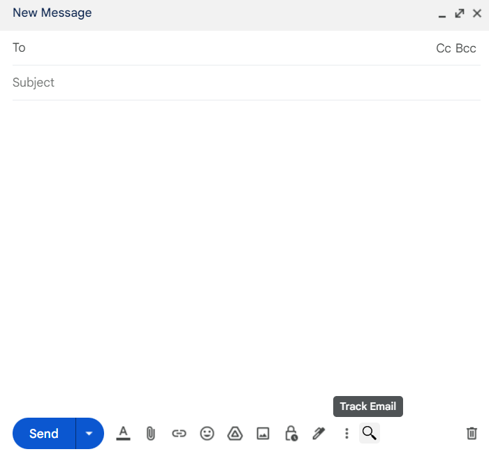
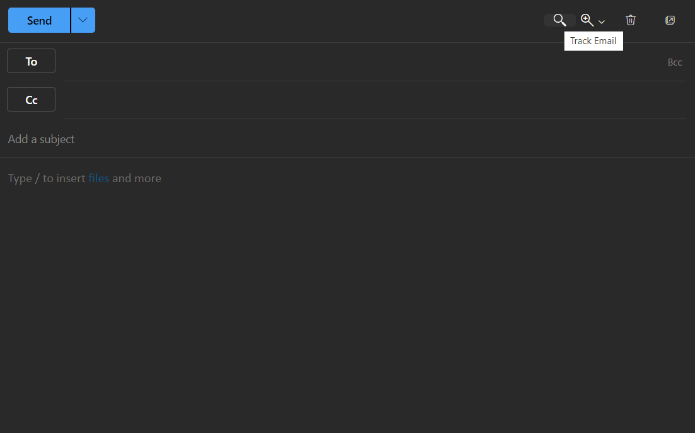

# EmailTracker
 **Allows you to add an email tracking pixel to Gmail and Outlook on the web.**

 ## Gmail
 

 ## Outlook
 
___
 `extension/` contains the code for the Chrome extension that adds the icon + injecting image functionality.
 > **Note:** The `SERVER_URL` must be provided on line 2 of `extension/email.js`
 
 **To load an unpacked extension:**
 1. Go to the Extensions page by entering `chrome://extensions` in a new tab.
     * Alternatively, click on the Extensions menu puzzle button and select **Manage Extensions** at the bottom of the menu.
     * Or, click the Chrome menu, hover over **More Tools,** then select **Extensions**.
 2. Enable Developer Mode by clicking the toggle switch next to **Developer mode.**
 3. Click the **Load unpacked** button and select the extension directory (`extension/`).
___
 `server/` contains the code for the server that the image URL goes to. 
 
 `cd server` and run `npm install`
 
 > **Note:** Environment variables must be provided in a `.env` file as explained in `server/.env.template`
